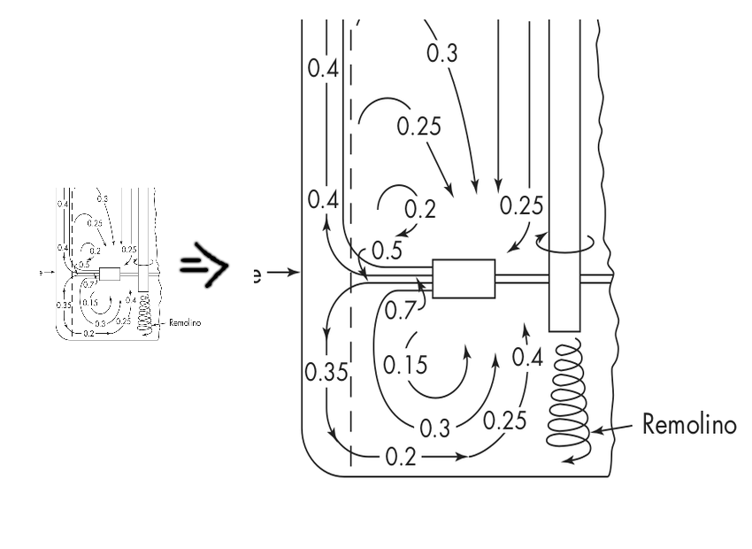

# Graficas-SuperResolucion
El objetivo de este proyecto es crear una red neuronal que aumente la calidad y resolución de imágenes que contengan gráficas y figuras.

  

<b>SOBRE EL DATASET</b>

disponible en  --- > https://drive.google.com/drive/folders/1E0gTYOyQ0IbbT5FBJ6kR9hsjoD5hZaD1?usp=sharing

El  dataset contine 1000 imágenes que obtuve de los libros que incluí en la carpeta "Fuentes", las imágenes son en su mayoría diagramas , gráficas e ilustraciones simples en blanco y negro  pero tambien contiene algunas imágenes con solo texto y ecuaciones.
Las junté con el objetivo de a lo largo del resto del curso experimentar haciedo alguna  red de super resolución específicamente entrenada para este tipo de imágenes. (Nunca falta que la imágen que quieres usar para el latex o para alguna presentación sea de muy baja resolucion y se vea mal :P ) 

-> La carpeta imágenes contiene las imágenes que extraje directamente de los libros.

-> En la carpeta Pre-Procesado, estan dos subcarpetas donde desordeno, renombro y reescalo las imágenes en 600x600 pixeles y en 200x200 pixeles respectivamente. 
